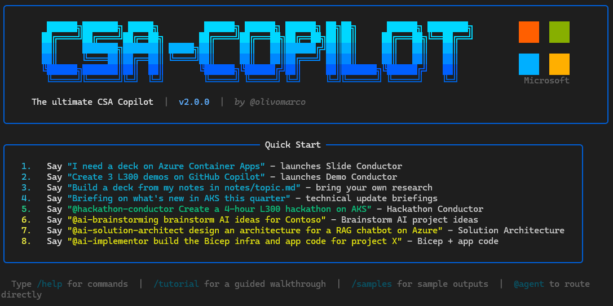

# CSA-Copilot - The Ultimate Copilot for Cloud Solution Architects

> Your AI-powered engagement platform - from first meeting prep to production-ready Azure delivery



---

## Quick Index

- [CSA-Copilot - The Ultimate Copilot for Cloud Solution Architects](#csa-copilot---the-ultimate-copilot-for-cloud-solution-architects)
  - [Quick Index](#quick-index)
  - [What This Is](#what-this-is)
  - [A Day in the Life](#a-day-in-the-life)
  - [Four Workflows](#four-workflows)
    - [1. Presentations](#1-presentations)
    - [2. Demos](#2-demos)
    - [3. AI Projects - Idea to Production](#3-ai-projects---idea-to-production)
      - [Stage 1: Brainstorming](#stage-1-brainstorming)
      - [Stage 2: Solution Architecture](#stage-2-solution-architecture)
      - [Stage 3: Implementation](#stage-3-implementation)
    - [4. Hackathon Events](#4-hackathon-events)
  - [Sample Outputs](#sample-outputs)
  - [Architecture](#architecture)
  - [Quality and Trust](#quality-and-trust)
  - [Observability and Cost Tracking](#observability-and-cost-tracking)
  - [Content Levels](#content-levels)
  - [Slide Session Durations](#slide-session-durations)
  - [Responsible AI](#responsible-ai)
  - [Prerequisites](#prerequisites)
  - [Getting Started](#getting-started)
    - [One-time setup: authenticate the GitHub CLI](#one-time-setup-authenticate-the-github-cli)
    - [Option A - Docker (recommended)](#option-a---docker-recommended)
    - [Option B - GitHub Codespaces (zero install)](#option-b---github-codespaces-zero-install)
    - [Option C - Native install](#option-c---native-install)
  - [Usage Examples](#usage-examples)
    - [Generate a presentation](#generate-a-presentation)
    - [Generate demo guides](#generate-demo-guides)
    - [Generate from your own notes](#generate-from-your-own-notes)
    - [Generate a technical update briefing](#generate-a-technical-update-briefing)
    - [Run the full AI project lifecycle](#run-the-full-ai-project-lifecycle)
    - [Direct @mentions](#direct-mentions)
  - [Slash Commands](#slash-commands)

---

## What This Is

You know the drill. A customer meeting lands on your calendar, and suddenly you need a 45-slide deck on a service you last touched three months ago. The official deck is two releases behind. Your demo scripts live in five different OneNote pages, none of them complete. You spend the evening before the session copy-pasting from MS Learn, wrangling PowerPoint layouts, and hoping your live demo won't blow up.

CSA-Copilot exists to kill that cycle.

It is a terminal-based AI platform built on the GitHub Copilot SDK that covers **four distinct workflows** a CSA or Solution Engineer deals with regularly:

1. **Presentations** - Generate a complete `.pptx` with speaker notes from a single prompt. Research happens against official sources, not hallucinations.
2. **Demos** - Generate step-by-step demo guides with runnable companion scripts, troubleshooting tables, and "say this" presenter cues.
3. **AI Projects** - Go from a blank page to a production-ready Azure project: brainstorm ideas, design architecture with cost estimates, and generate Bicep infra + app code + CI/CD + tests - all reviewed by 4 specialist agents before delivery.
4. **Hackathon Events** - Create complete What-The-Hack-style hackathon packages with progressively harder challenges, step-by-step solutions, coach materials, and dev containers - ready to push as a Git repo for your event.

Each workflow is run by a **conductor agent** that orchestrates specialist subagents, asks for your approval at key stops, and runs automated quality checks before handing you the output. 24 agents work together behind the scenes, but you just type a prompt.

> [!IMPORTANT]
> **This is deep research, not instant generation.** A full slide deck typically takes **1 hour or more**. Even more for AI-production use cases. That time is real work: multi-step research against MS Learn and official docs, source verification, content QA, and humanization checks. What it replaces is the 4-8 hours of manual research and assembly you'd do yourself - often the night before. Kick it off and work on something else. Demo generation runs 30-45 minutes. AI project builds vary by scope, but expect at least north of 1 hour.

> **Accelerator, not autopilot.** The output is a strong first draft with sourced claims, tested code, and acceptable graphics. You own it, you refine it, you present it. Review before every customer session.

---

## A Day in the Life

CSA-Copilot shows up at different points in a CSA's week. Here are the moments where it saves you real time.

| Your situation | What you tell CSA-Copilot | What happens |
|----------------|---------------------------|-------------|
| **Monday standup** - your manager wants a tech update for the team | "Create a 15min L200 briefing on what's new in AKS this quarter" | Slide Conductor researches recent AKS announcements from MS Learn and devblogs, builds a 12-slide deck with speaker notes. Ready for your team sync. |
| **Customer prep** - Contoso meeting Wednesday, they want deep Copilot coverage | "I need a 1-hour L300 deck on GitHub Copilot agent extensions for financial services" | Researches official docs, asks what sub-areas to focus on, presents a plan for your approval, builds 30 slides with full presenter transcripts in the notes. |
| **You already have notes** - spent last week collecting research in a .md file | "Build a 30min L200 deck from my notes in notes/aks-security-review.md" | Reads your file, structures it into a presentation outline, builds the deck from your material instead of web research. Your knowledge, polished format. |
| **Demo day** - customer wants to see Container Apps in action | "Create 3 L300 demos on Azure Container Apps for Contoso" | Demo Conductor produces a guide with step-by-step instructions, companion .sh and .py scripts, troubleshooting tables, and "say this" boxes so you know exactly what to tell the audience at each step. |
| **Pre-sales brainstorm** - "what AI projects should we propose to this healthcare company?" | "@ai-brainstorming Brainstorm AI use cases for a healthcare company" | Researches the customer context, generates 10+ ranked ideas with impact scores, difficulty ratings, Azure services for each, and a phased roadmap (0-3 months, 3-9, 9-18). |
| **Architecture engagement** - customer approved idea #3, need design docs | "@ai-solution-architect Design the architecture for idea #3" | Produces 5 documents: solution design, draw.io diagram, ASCII diagram, cost estimation with SKU-level pricing, and a delivery plan with phases and risks. All Azure-only. |
| **Delivery kickoff** - time to build the thing | "@ai-implementor Implement the solution" | Generates Bicep infrastructure, application code, CI/CD pipelines, deploy scripts, unit tests (80% coverage gate), smoke tests, and README. Four specialist reviewers (code, infra, pipeline, docs) must all approve before delivery. |
| **Pick up where you left off** - started a generation yesterday, want to continue | `/resume` | Loads your previous session with full context. Sessions survive across days and weeks. |
| **Partner enablement event** - need a hands-on hackathon for a partner workshop | "@hackathon-conductor Create a full-day L300 hackathon on Azure Container Apps for developers" | Hackathon Conductor researches the topic, plans 8 progressively harder challenges, builds student guides + coach solutions + dev container + facilitation materials. Ready to push as a Git repo. |

---

## Four Workflows

### 1. Presentations

The **Slide Conductor** takes a topic, audience level, and session length, then produces a finished `.pptx` file. It researches official sources, presents a plan for your approval, builds the slides, runs QA checks, and drops the `.pptx` plus its generator script into `outputs/slides/`.

Also handles:

- **Technical update briefings** - e.g. monthly or quarterly "what's new" decks for your team or stakeholders, researched from official sources
- **Slides from your own research** - point it at a .md file with your notes and it builds the deck from your material

---

### 2. Demos

The **Demo Conductor** produces a complete demo guide in Markdown with companion scripts you can actually run. It researches existing demos and quickstarts, presents a plan for your approval, builds the guides with review cycles, and delivers everything to `outputs/demos/`.

**What you get in each demo:**

- Step-by-step instructions with expected output
- "Say this" boxes - exactly what to tell the audience at each step
- WOW moment - the one thing that makes the audience go "oh, that's cool"
- Troubleshooting table - common failures and fixes
- Companion scripts - ready to run, not pseudocode

---

### 3. AI Projects - Idea to Production

Three conductor agents take you from a blank page to a deployable Azure project, with mandatory quality gates at every stage.

#### Stage 1: Brainstorming

Describe a customer's industry, objectives, and constraints. The `ai-brainstorming` agent generates **10+ prioritized AI project ideas** with impact scores, difficulty ratings, Azure service mappings, and a phased roadmap.

#### Stage 2: Solution Architecture

Pick an idea from the brainstorming output. The `ai-solution-architect` agent runs a discovery session and produces **5 architecture documents**: solution design, draw.io diagram, ASCII diagram, cost estimation with SKU-level pricing, and a delivery plan. All reviewed for accuracy and completeness before delivery.

#### Stage 3: Implementation

The `ai-implementor` agent builds Bicep infrastructure, application code, CI/CD pipelines, deploy scripts, tests (80% coverage gate), and documentation. A **4-reviewer gate** (code, infra, pipeline, docs) must all approve before anything is delivered.

**Output structure:**

```text
outputs/ai-projects/{slug}/
  +-- README.md
  +-- docs/           (solution-design, diagrams, cost, delivery plan)
  +-- infra/          (Bicep modules + params)
  +-- src/            (application code)
  +-- tests/          (unit, smoke, validate.sh)
  +-- scripts/        (deploy.sh)
  +-- .github/workflows/
```

---

### 4. Hackathon Events

The **Hackathon Conductor** creates complete What-The-Hack-style hackathon packages ready to push as a Git repo for customer or partner enablement events. It researches the topic, plans a progressive challenge set for your approval, builds challenges and solutions in parallel, generates coach materials, and runs QA before delivery.

**What you get:**

- Progressive challenges (challenge-00 through challenge-N) with increasing difficulty
- Step-by-step solutions for each challenge (coaches only)
- Dev container for GitHub Codespaces (participants open the repo and start coding)
- Facilitation guide with per-challenge coaching tips, timing, and pivot strategies
- Scoring rubric with verification commands per challenge
- Top-level README as the event landing page

**Difficulty curve:**

| Duration | Challenges | Spread |
|----------|-----------|--------|
| 2 hours | 3-4 | setup + 2 easy + 1 medium |
| 4 hours | 5-6 | setup + 2 easy + 2 medium + 1 hard |
| 8 hours | 8-10 | setup + 2 easy + 3 medium + 2 hard + 1 expert |
| 16 hours | 12-15 | setup + 3 easy + 4 medium + 3 hard + 2 expert |

**Output structure:**

```text
outputs/hackathons/{event-slug}/
  +-- README.md
  +-- .devcontainer/      (Codespaces-ready)
  +-- challenges/         (challenge-00 through challenge-N)
  +-- solutions/          (step-by-step per challenge)
  +-- coach/              (facilitation guide + scoring rubric)
  +-- resources/          (reference architecture + starter files)
```

---

## Sample Outputs

The slides, code and demos below - **un-edited on purpose** - were generated by CSA-Copilot on different topics. Same for the hackathons and AI projects in their respective folders. This is the **raw output**, straight from the agents, to give you a real sense of what to expect.

| | | | |
|:---:|:---:|:---:|:---:|
|  |  |  |  |
| Title slide | Section | Technical deep dive | Architecture pattern |

*From: Microsoft Fabric - Trustworthy Data (L300, 2h) - generated by Slide Conductor*

Browse the full output library:

- [samples/slides/](samples/slides/README.md) - generated `.pptx` decks and generator scripts
- [samples/demos/](samples/demos/README.md) - generated demo guides and companion scripts
- [samples/hackathons/](samples/hackathons/README.md) - generated hackathon packages with challenges, coach materials, and dev containers
- [samples/ai-projects/](samples/ai-projects/README.md) - generated AI projects with Bicep infra, app code, tests, and architecture docs

---

## Architecture

**Routing.** The router uses a two-step strategy. If you type `@agent-name`, the message goes directly to that agent. Otherwise, a lightweight GPT-4.1 classifier reads your prompt, compares it against all routable agent descriptions, and picks the best match. If neither approach finds a match, the default Copilot agent handles it as free-form conversation.

**Model selection.** When an agent is selected, the session automatically switches to that agent's preferred model. Slide and demo conductors use claude-sonnet-4.6. Brainstorming and architecture agents use claude-opus-4.6 for deeper reasoning. The implementor uses claude-sonnet-4.6 for speed. You can override anytime with `/model`.

---

## Quality and Trust

The whole point of this tool is producing content you can put in front of a customer without embarrassment. Several mechanisms work together to make that happen.

**Research from official sources only.** Every research subagent is restricted to MS Learn, docs.github.com, github.blog, devblogs.microsoft.com, and techcommunity.microsoft.com. No random blog posts, no Stack Overflow guesses, no made-up URLs. Every link in the output is real and was fetched during generation.

**Human approval stops.** Every conductor pauses after the research phase and presents a plan. You approve, modify, or reject it before any content gets built. You also review the final output before it's considered done.

**Automated QA checks.** Each workflow runs programmatic validation before delivery:

- **PPTX QA** - shape overflow detection, placeholder text scanning, speaker notes presence, font size validation, slide count verification
- **Architecture QA** - document completeness, Azure mandate compliance, placeholder-free content, diagram accuracy
- **Infrastructure QA** - Bicep syntax, module decomposition, Key Vault usage, managed identity for secrets, RBAC configuration
- **Pipeline QA** - YAML syntax, job dependencies, secrets via environment variables, deploy script safety
- **Documentation QA** - section completeness, path accuracy, command correctness, environment variable documentation
- **Hackathon QA** - sequential challenge numbering, required sections per challenge, matching solutions, coach materials, dev container validity, cross-reference consistency

**Content humanization.** Generated text goes through AI-tell detection that flags filler words, hedging phrases, uniform sentence structure, and a blacklist of overused AI vocabulary. A humanity scoring system rates the output and triggers rewrites if the score is too low. The goal is content that reads like a person wrote it, not a chatbot.

**4-reviewer gate for AI projects.** The implementor cannot deliver until four independent specialist reviewers (code, infra, pipeline, docs) each return APPROVED. If any one of them flags an issue, targeted fixes are applied and that reviewer runs again. No shortcuts.

**80% test coverage.** Code projects must pass a `pytest --cov` threshold of 80% before the code reviewer will approve.

---

## Observability and Cost Tracking

CSA-Copilot tracks token usage, timing, and estimated costs in a local SQLite database at `~/.csa-copilot/csa-copilot.db`. Nothing leaves your machine.

**What gets tracked:**

- Input and output tokens per turn, including cache reads and writes
- Estimated USD cost per turn (based on published model pricing)
- Tool call and subagent invocation counts
- Session duration, turn count, and agent/model per session

**How to access it:**

| Command | What it shows |
|---------|--------------|
| `/usage` | Current session: token counts, estimated cost, context window capacity |
| `/usage all` | Global aggregates: total tokens and cost broken down by agent, model, and time period |
| `/usage today` | Today's usage across all sessions |
| `/usage week` | This week's usage |
| `/usage month` | This month's usage |
| `/usage --agent slide-conductor` | Usage filtered to a specific agent |
| `/usage --model claude-opus-4.6` | Usage filtered to a specific model |

**Session inspection.** You can drill into any past session:

| Command | What it shows |
|---------|--------------|
| `/sessions` | Active and resumable sessions |
| `/sessions all` | All sessions, including ended ones |
| `/sessions <id>` | Detail view of a specific session |
| `/sessions <id> turn 3` | Content of a specific turn within a session |
| `/sessions <id> invocations` | Full trace of tool calls and subagent dispatches for that session |
| `/sessions name <id> <nick>` | Give a session a nickname for easy reference |
| `/sessions end <id>` | End a specific session |
| `/sessions cleanup` | Purge old sessions |

Sessions are **resumable by default**. Start a generation on Monday, come back Thursday, type `/resume`, and pick up with full context.

---

## Content Levels

| Level | Audience | Description |
|-------|----------|-------------|
| **L100** | Business / Executive | Value propositions, no code |
| **L200** | Technical decision makers | Architecture, key concepts |
| **L300** | Practitioners | Implementation, code samples, best practices |
| **L400** | Experts | Internals, performance, advanced patterns |

## Slide Session Durations

| Duration | Approx. slides |
|----------|---------------|
| 15 min | 10-14 |
| 30 min | 15-20 |
| 1 hour | 25-35 |
| 2 hours | 40-55 |
| 4 hours | 70-90 |

---

## Responsible AI

CSA-Copilot uses AI models to produce customer-facing technical content. The following principles apply:

**Human in the loop.**
Every pipeline has mandatory approval stops before content is built and before output is delivered. No content reaches a customer without a human reviewing and accepting the plan.

**Accuracy over speed.**
All research is restricted to official Microsoft and GitHub sources (MS Learn, docs.github.com, devblogs.microsoft.com, techcommunity.microsoft.com). Invented URLs are explicitly forbidden; every link in generated output must be real and verifiable.

**Transparency.**
Generated `.pptx` files and demo guides are first drafts, not finished deliverables. The README, app UI, and speaker notes all state this. Users are expected to review, fact-check, and own the content before presenting it.

**No sensitive data in prompts.**
Do not include customer names, internal project codenames, NDA-protected details, pricing data, or personal information in generation prompts. Use generic placeholders (e.g. "Contoso") when a customer name is needed for narrative context.

**Content scope.**
The tool is scoped to technical education content for Microsoft Cloud products. It is not intended to generate marketing claims, competitive comparisons, financial projections, or legal/compliance guidance.

**Model behaviour.**
This tool delegates to GitHub Copilot models via the GitHub Copilot SDK. It does not fine-tune or modify model weights. All model usage is subject to the [GitHub Copilot Terms of Service](https://docs.github.com/en/site-policy/github-terms/github-terms-for-additional-products-and-features#github-copilot) and [Microsoft Responsible AI principles](https://www.microsoft.com/en-us/ai/responsible-ai).

---

## Prerequisites

- A **GitHub Copilot** subscription (Individual, Business, or Enterprise) with CLI access
- The [**GitHub CLI** (`gh`)](https://cli.github.com/) installed and authenticated (`gh auth login`) - required for Docker to pass your auth token into the container
- **One** of the following run methods:
  - **Docker** (recommended) - just Docker Desktop / Docker Engine
  - **GitHub Codespaces** - nothing to install, runs in the browser
  - **Native** - Python 3.11+, LibreOffice Impress, Poppler on your machine

## Getting Started

### One-time setup: authenticate the GitHub CLI

Before using any run method, authenticate the GitHub CLI. If you already use GitHub Copilot in VS Code, you still need this step for Docker and native usage.

```bash
# Install the GitHub CLI (if not already present)
# macOS:  brew install gh
# Linux:  see https://github.com/cli/cli/blob/trunk/docs/install_linux.md

# Sign in - opens a browser for device-flow auth
gh auth login

# Verify it works
gh auth token                 # should print a token
gh copilot --version          # confirms Copilot extension works
```

This stores your GitHub OAuth token in your OS credential store (macOS Keychain, Windows Credential Manager) where `gh auth token` can retrieve it.

---

### Option A - Docker (recommended)

The Docker image bundles Python, LibreOffice, Poppler, and all pip dependencies. Nothing else to install.

```bash
# Clone the repo
git clone https://github.com/olivomarco/csa-copilot.git
cd csa-copilot

# Build the image (first time only, ~1 GB)
docker build -t csa-copilot .

# Run the TUI
docker run -it --rm \
  -e GITHUB_TOKEN=$(gh auth token) \
  -v "$(pwd)/outputs:/app/outputs" \
  csa-copilot
```

| Parameter | Purpose |
|-----------|---------|
| `-e GITHUB_TOKEN=$(gh auth token)` | Passes your GitHub auth token into the container |
| `./outputs` -> `/app/outputs` | Generated `.pptx`, demo guides, and scripts persist on your host |

> [!TIP]
> Add an alias for convenience:
>
> ```bash
> alias csa='docker run -it --rm -e GITHUB_TOKEN=$(gh auth token) -v "$(pwd)/outputs:/app/outputs" csa-copilot'
> ```
>
> Then just run `csa` from inside the repo.

> [!NOTE]
> **Why `GITHUB_TOKEN`?** On native installs, the Copilot CLI reads tokens from your OS credential store
> (macOS Keychain / Windows Credential Manager). Docker containers cannot access the host credential
> store, so the token is passed via environment variable instead. The `gh auth token` command extracts
> it for you automatically.

---

### Option B - GitHub Codespaces (zero install)

If you don't want to install anything locally, open the repo in a Codespace. The dev container installs all system and Python dependencies automatically.

1. Go to the repo on GitHub and click **Code** -> **Codespaces** -> **Create codespace on main**
2. Wait for the container to build (~2-3 minutes the first time)
3. In the Codespace terminal, run:

```bash
python app.py
```

That's it - LibreOffice, Poppler, and all Python packages are pre-installed by the dev container.

> [!NOTE]
> Codespaces requires a GitHub plan with Codespaces minutes (free tier includes 60h/month for individual accounts).

---

### Option C - Native install

For users who prefer running directly on their machine without containers.

**System dependencies** (install once):

```bash
# Ubuntu / Debian
sudo apt-get update && sudo apt-get install -y libreoffice-impress poppler-utils

# macOS (via Homebrew)
brew install --cask libreoffice && brew install poppler

# Fedora / RHEL
sudo dnf install libreoffice-impress poppler-utils
```

**Python setup:**

```bash
cd csa-copilot
python -m venv .venv && source .venv/bin/activate
pip install .
```

**Run:**

```bash
python app.py
```

---

## Usage Examples

### Generate a presentation

```text
>>> I need a 1-hour L300 deck on GitHub Copilot agent extensions for financial services
  >> routed -> slide-conductor | model: claude-sonnet-4.6

  ? Agent asks: I found these sub-areas from official docs...
  ...
  [Phase 0-4 proceeds automatically with approval stops]
  ...
  OK: Saved outputs/slides/gh-copilot-extensions-l300-1h.pptx (30 slides)
```

### Generate demo guides

```text
>>> Create 3 L300 demos on Azure Container Apps for Contoso
  >> routed -> demo-conductor | model: claude-sonnet-4.6

  ? Agent asks: What specific aspects should the demos cover?
  ...
  [Phase 0-5 proceeds automatically with approval stops]
  ...
  OK: Saved outputs/demos/contoso-aca-demos.md + 3 companion files
```

### Generate from your own notes

```text
>>> Build a 30min L200 deck from my notes in notes/aks-security-review.md
  >> routed -> slide-conductor | model: claude-sonnet-4.6

  ? Agent reads your notes file, identifies key topics...
  ...
  [Phase 2-4 proceeds - planning from your content, then build + QA]
  ...
  OK: Saved outputs/slides/aks-security-review-l200-30m.pptx (18 slides)
```

### Generate a technical update briefing

```text
>>> Create a 15min L200 briefing on what's new in Azure Kubernetes Service this quarter
  >> routed -> slide-conductor | model: claude-sonnet-4.6

  ? Agent researches recent AKS announcements and changelog...
  ...
  [Phase 0-4 proceeds automatically with approval stops]
  ...
  OK: Saved outputs/slides/aks-quarterly-update-l200.pptx (12 slides)
```

### Run the full AI project lifecycle

```text
>>> @ai-brainstorming Brainstorm AI use cases for a healthcare company
  >> routed -> ai-brainstorming | model: claude-opus-4.6
  ...
  OK: Saved outputs/ai-projects/healthcare-ai/docs/brainstorming.md (10+ ranked ideas)

>>> @ai-solution-architect Design the architecture for idea #3
  >> routed -> ai-solution-architect | model: claude-opus-4.6
  ...
  OK: Saved 5 architecture documents to outputs/ai-projects/healthcare-ai/docs/

>>> @ai-implementor Implement the solution
  >> routed -> ai-implementor | model: claude-sonnet-4.6
  ...
  OK: Saved infra + src + tests + scripts to outputs/ai-projects/healthcare-ai/
```

### Direct @mentions

You can always skip the router and go straight to a specific agent:

```text
>>> @slide-conductor Make a 30min L200 deck on Microsoft Fabric
>>> @demo-conductor Build 2 demos on GitHub Actions for Zava Industries
>>> @ai-brainstorming Brainstorm AI use cases for a retail company improving CX
>>> @ai-solution-architect Design the architecture for a customer service chatbot on Azure
>>> @ai-implementor Implement the infrastructure and app code for the chatbot solution
```

---

## Slash Commands

| Command | Description |
|---------|-------------|
| `/new [agent]` | Start a new session (optionally pre-selecting an agent) |
| `/resume [id\|name]` | Resume a previous session |
| `/agent <name>` | Switch to a specific agent mid-session |
| `/agents` | List all available agents with details |
| `/model <id>` | Switch the LLM model |
| `/compact` | Manually compact context window (free memory) |
| `/debug` | Toggle debug mode (shows tool I/O, subagent flow, token usage) |
| `/sessions` | List active and resumable sessions |
| `/sessions all` | All sessions including ended ones |
| `/sessions <id>` | Detail view of a specific session |
| `/sessions <id> turn <N>` | Show a specific turn within a session |
| `/sessions <id> invocations` | Tool call and subagent trace for a session |
| `/sessions name <id> <nick>` | Set a session nickname |
| `/sessions end <id>` | End a specific session |
| `/sessions cleanup` | Purge old sessions |
| `/usage` | Current session: tokens, cost, context window |
| `/usage all` | Global usage aggregates by agent, model, period |
| `/usage today\|week\|month` | Usage filtered by time period |
| `/usage --agent <name>` | Usage filtered to a specific agent |
| `/usage --model <name>` | Usage filtered to a specific model |
| `/samples` | Show sample output library |
| `/tutorial` | Interactive guided walkthrough |
| `/clear` | Clear the screen and redisplay the banner |
| `/help` | Show quick command reference |
| `/quit` | Exit CSA-Copilot (session remains resumable) |
